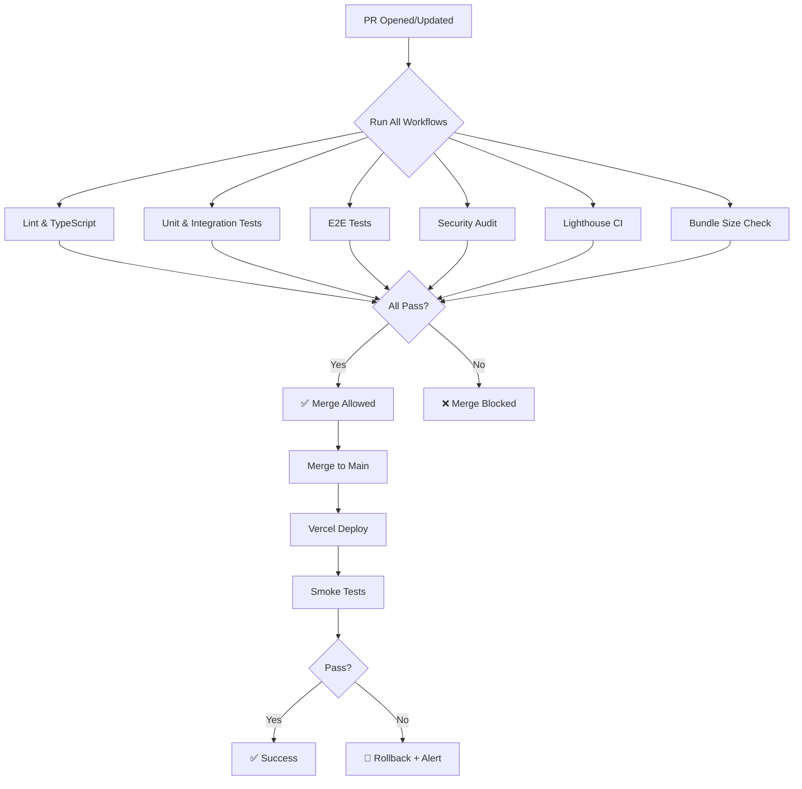

# GitHub Actions Workflows 🔄 - FullColor Cotizador# GitHub Actions Workflows — FullColor Cotizador


> **CI/CD completo: Tests, E2E, Security**  > **Propósito:** Documentación completa de los workflows de CI/CD configurados para garantizar calidad, performance y seguridad en cada push y pull request.

> **Basado en análisis real del repositorio**

---

---

## 📋 Tabla de Contenidos

## 📊 Estado Actual (Workflows Existentes)

1. [Arquitectura de CI/CD](#arquitectura-de-cicd)

### ✅ 3 Workflows Activos2. [Workflows Existentes](#workflows-existentes)

3. [Gates de Calidad](#gates-de-calidad)

```4. [Configuración de Secrets](#configuración-de-secrets)

.github/workflows/5. [Workflows Propuestos](#workflows-propuestos)

├── tests-unit.yml          (60 líneas) ✅ ACTIVO6. [Troubleshooting](#troubleshooting)

├── tests-e2e.yml           (69 líneas) ✅ ACTIVO

└── security-audit.yml      (129 líneas) ✅ ACTIVO---

```

## Arquitectura de CI/CD

---

```

## 1️⃣ Tests Unitarios (`tests-unit.yml`)┌─────────────────────────────────────────────────────────────┐

│                    Pull Request / Push                      │

### Configuración└─────────────┬───────────────────────────────────────────────┘

```yaml              │

name: Unit & Integration Tests     ┌────────┴────────┐

     │   GitHub Actions │

on:     └────────┬────────┘

  push:              │

    branches: [ main, develop ]  ┌───────────┼───────────┐

  pull_request:  │           │           │

    branches: [ main, develop ]┌─▼──┐    ┌──▼──┐    ┌──▼──┐

│Test│    │Perf │    │ Sec │  (Parallel)

jobs:└─┬──┘    └──┬──┘    └──┬──┘

  test:  │          │          │

    runs-on: ubuntu-latest  └──────────┼──────────┘

                 │

    strategy:        ┌────▼────┐

      matrix:        │All Pass?│

        node-version: [18.x, 20.x]        └────┬────┘

```             │

        ┌────▼────┐

### Steps        │ Deploy  │ (Vercel)

1. **Checkout code** - `actions/checkout@v4`        └─────────┘

2. **Setup Node.js** - `actions/setup-node@v4````

   - Matrix: Node 18.x, 20.x

   - Cache npm dependencies**Flujo:**

3. **Install dependencies** - `npm ci`1. Developer abre PR o hace push a `main`/`develop`

4. **Run unit tests** - `npm run test:unit`2. GitHub Actions ejecuta workflows en paralelo

5. **Run integration tests** - `npm run test:integration`3. Si todos pasan → ✅ Merge permitido / Deploy automático

6. **Generate coverage** - `npm run test:coverage`4. Si alguno falla → ❌ Merge bloqueado + notificación

7. **Upload to Codecov** - `codecov/codecov-action@v3`

   - Flags: `unittests`---

   - Files: `coverage/coverage-final.json`

8. **Upload coverage artifact** - `actions/upload-artifact@v3`## Workflows Existentes

   - Name: `coverage-report-{node-version}`

   - Path: `coverage/`### 1. Unit & Integration Tests


### Duración Típica**Archivo:** `.github/workflows/tests-unit.yml`

- ⏱️ ~2-3 minutos por matrix job

- ⏱️ ~4-6 minutos total (paralelo)**Trigger:**

- Push a `main`, `develop`

### Estado- Pull requests a `main`, `develop`

✅ **FUNCIONAL** - 73 tests pasando

**Jobs:**

---

```yaml

## 2️⃣ Tests E2E (`tests-e2e.yml`)name: Unit & Integration Tests


### Configuraciónon:

```yaml  push:

name: E2E Tests    branches: [ main, develop ]

  pull_request:

on:    branches: [ main, develop ]

  push:

    branches: [ main, develop ]jobs:

  pull_request:  test:

    branches: [ main, develop ]    runs-on: ubuntu-latest

    strategy:

jobs:      matrix:

  test-e2e:        node-version: [18.x, 20.x]

    timeout-minutes: 60    

    runs-on: ubuntu-latest    steps:

```      - name: 📥 Checkout code

        uses: actions/checkout@v4

### Steps      

1. **Checkout code** - `actions/checkout@v4`      - name: 🔧 Setup Node.js ${{ matrix.node-version }}

2. **Setup Node.js** - `actions/setup-node@v4`        uses: actions/setup-node@v4

   - Node 20        with:

   - Cache npm          node-version: ${{ matrix.node-version }}

3. **Install dependencies** - `npm ci`          cache: 'npm'

4. **Install Playwright Browsers** - `npx playwright install --with-deps`      

5. **Build Next.js app** - `npm run build`      - name: 📦 Install dependencies

   - Env vars:        run: npm ci

     - `NEXT_PUBLIC_SUPABASE_URL`: `${{ secrets.NEXT_PUBLIC_SUPABASE_URL || 'https://test.supabase.co' }}`      

     - `NEXT_PUBLIC_SUPABASE_ANON_KEY`: `${{ secrets.NEXT_PUBLIC_SUPABASE_ANON_KEY || 'test-key' }}`      - name: 🧪 Run unit tests

6. **Run E2E tests** - `npm run test:e2e`        run: npm run test:unit

   - Env vars: `PLAYWRIGHT_TEST_BASE_URL: http://localhost:3000`      

7. **Upload Playwright Report** - `actions/upload-artifact@v3` (always)      - name: 🔗 Run integration tests

   - Name: `playwright-report`        run: npm run test:integration

   - Path: `playwright-report/`      

   - Retention: 30 days      - name: 📊 Generate coverage report

8. **Upload test videos** - `actions/upload-artifact@v3` (if failure)        run: npm run test:coverage

   - Name: `test-videos`      

   - Path: `test-results/`      - name: 📈 Upload coverage to Codecov

   - Retention: 7 days        uses: codecov/codecov-action@v3

9. **E2E Test Summary** - GitHub Step Summary (always)        with:

          files: ./coverage/coverage-final.json

### Duración Típica          flags: unittests

- ⏱️ ~8-12 minutos (incluye build + 6 navegadores)          name: codecov-umbrella

      

### Estado      - name: 📄 Upload coverage report as artifact

⚠️ **PROBABLEMENTE FALLANDO** - Debido a build error en `/auth/login`        uses: actions/upload-artifact@v3

        with:

---          name: coverage-report-${{ matrix.node-version }}

          path: coverage/

## 3️⃣ Security Audit (`security-audit.yml`)```


### Configuración**Gates:**

```yaml- ✅ Tests pasan en Node 18 y 20

name: Security Audit- ✅ Coverage > 50% (configurado en `jest.config.ts`)

- ⚠️ Coverage subido a Codecov (informativo)

on:

  push:**Mejoras propuestas:**

    branches: [ main, develop ]- [ ] Agregar cache de `node_modules` para velocidad

  pull_request:- [ ] Reportar cobertura como comentario en PR

    branches: [ main, develop ]- [ ] Bloquear merge si coverage baja del actual

  schedule:

    - cron: '0 0 * * 1'  # Lunes 00:00 UTC---

```

### 2. E2E Tests (Playwright)

### Job 1: dependency-audit

**Steps:****Archivo:** `.github/workflows/tests-e2e.yml`

1. Checkout code

2. Setup Node.js 20**Trigger:**

3. Install dependencies - `npm ci`- Push a `main`, `develop`

4. **Run npm audit** - `npm audit --audit-level=moderate`- Pull requests a `main`, `develop`

   - Continue-on-error: true

5. **Check for vulnerabilities** - `npm audit --json > audit-report.json`**Jobs:**

6. **Upload audit report** - Artifact `npm-audit-report`

7. **Audit Summary** - GitHub Step Summary```yaml

name: E2E Tests

**Duración:** ~2 minutos

on:

---  push:

    branches: [ main, develop ]

### Job 2: dependency-review  pull_request:

**Trigger:** Solo en PRs    branches: [ main, develop ]


**Steps:**jobs:

1. Checkout code  test-e2e:

2. **Dependency Review** - `actions/dependency-review-action@v3`    timeout-minutes: 60

   - fail-on-severity: `moderate`    runs-on: ubuntu-latest

   - Compara dependencies PR vs base branch    

   - Bloquea si introduce vulnerabilities ≥ moderate    steps:

      - name: 📥 Checkout code

**Duración:** ~1 minuto        uses: actions/checkout@v4

      

---      - name: 🔧 Setup Node.js

        uses: actions/setup-node@v4

### Job 3: codeql-analysis        with:

**Configuración:**          node-version: 20

```yaml          cache: 'npm'

strategy:      

  matrix:      - name: 📦 Install dependencies

    language: [ 'javascript', 'typescript' ]        run: npm ci

      

permissions:      - name: 🎭 Install Playwright Browsers

  actions: read        run: npx playwright install --with-deps

  contents: read      

  security-events: write      - name: 🚀 Build Next.js app

```        run: npm run build

        env:

**Steps:**          NEXT_PUBLIC_SUPABASE_URL: ${{ secrets.NEXT_PUBLIC_SUPABASE_URL }}

1. Checkout code          NEXT_PUBLIC_SUPABASE_ANON_KEY: ${{ secrets.NEXT_PUBLIC_SUPABASE_ANON_KEY }}

2. **Initialize CodeQL** - `github/codeql-action/init@v2`      

   - Languages: JS/TS matrix      - name: 🧪 Run E2E tests

3. **Autobuild** - `github/codeql-action/autobuild@v2`        run: npm run test:e2e

4. **Perform CodeQL Analysis** - `github/codeql-action/analyze@v2`        env:

   - Category: `/language:{js|ts}`          PLAYWRIGHT_TEST_BASE_URL: http://localhost:3000

          NEXT_PUBLIC_SUPABASE_URL: ${{ secrets.NEXT_PUBLIC_SUPABASE_URL }}

**Duración:** ~5-8 minutos          NEXT_PUBLIC_SUPABASE_ANON_KEY: ${{ secrets.NEXT_PUBLIC_SUPABASE_ANON_KEY }}

      

---      - name: 📊 Upload Playwright Report

        uses: actions/upload-artifact@v3

### Job 4: performance-check        if: always()

**Steps:**        with:

1. Checkout code          name: playwright-report

2. Setup Node.js 20          path: playwright-report/

3. Install dependencies          retention-days: 30

4. **Build for production** - `npm run build`      

   - Env vars: test credentials      - name: 📹 Upload test videos

5. **Analyze bundle size**        uses: actions/upload-artifact@v3

   ```bash        if: failure()

   du -sh .next/static        with:

   echo "### Bundle Size 📦" >> $GITHUB_STEP_SUMMARY          name: test-videos

   ```          path: test-results/

6. **Check for sensitive data**          retention-days: 7

   ```bash```

   ! grep -r "password|secret|api_key" .next/static

   ```**Gates:**

- ✅ Todos los tests E2E pasan

**Duración:** ~3-5 minutos- ✅ Tests de accesibilidad sin violaciones

- 📊 Reportes y videos disponibles en artifacts

**Estado:** ⚠️ **PROBABLEMENTE FALLANDO** - Build error

**Mejoras propuestas:**

---- [ ] Agregar tests de smoke en producción (post-deploy)

- [ ] Paralelizar tests por proyecto (chromium, firefox, webkit)

## 🎯 Gates de Calidad- [ ] Agregar screenshots de comparación (visual regression)


| Gate | Workflow | Job | Bloquea Merge |---

|------|----------|-----|---------------|

| Unit tests passing | tests-unit.yml | test | ✅ Sí |### 3. Security Audit

| Integration tests passing | tests-unit.yml | test | ✅ Sí |

| E2E tests passing | tests-e2e.yml | test-e2e | ✅ Sí |**Archivo:** `.github/workflows/security-audit.yml`

| npm audit moderate | security-audit.yml | dependency-audit | ❌ No (continue-on-error) |

| Dependency review | security-audit.yml | dependency-review | ✅ Sí (solo PRs) |**Trigger:**

| CodeQL findings | security-audit.yml | codeql-analysis | ⚠️ Depende de severity |- Push a `main`, `develop`

| Build exitoso | tests-e2e.yml | test-e2e | ✅ Sí |- Pull requests a `main`, `develop`

| Build exitoso | security-audit.yml | performance-check | ❌ No |- Schedule: Lunes a las 00:00 UTC (semanal)


---**Jobs:**


## 📝 Secrets Requeridos```yaml

name: Security Audit

### GitHub Repository Secrets

on:

#### Obligatorios  push:

```    branches: [ main, develop ]

NEXT_PUBLIC_SUPABASE_URL  pull_request:

NEXT_PUBLIC_SUPABASE_ANON_KEY    branches: [ main, develop ]

```  schedule:

    - cron: '0 0 * * 1' # Weekly on Monday

**Dónde configurar:** GitHub Repo → Settings → Secrets and variables → Actions → Repository secrets

jobs:

**Uso:** Tests E2E y Performance Check  dependency-audit:

    runs-on: ubuntu-latest

**Fallback:** Si no están definidos, usa valores de prueba:    steps:

- `https://test.supabase.co`      - name: 📥 Checkout code

- `test-key`        uses: actions/checkout@v4

      

---      - name: 🔧 Setup Node.js

        uses: actions/setup-node@v4

#### Opcionales        with:

```          node-version: 20

CODECOV_TOKEN  # Para Codecov uploads (si repo privado)          cache: 'npm'

```      

      - name: 📦 Install dependencies

---        run: npm ci

      

## 🚀 Plan de Expansión      - name: 🔍 Run npm audit

        run: npm audit --audit-level=moderate

### Workflow 4: Lint & Type Check        continue-on-error: true

**Archivo:** `.github/workflows/lint.yml`      

      - name: 🔒 Check for known vulnerabilities

```yaml        run: npm audit --json > audit-report.json

name: Lint & Type Check        continue-on-error: true

      

on:      - name: 📄 Upload audit report

  push:        uses: actions/upload-artifact@v3

    branches: [ main, develop ]        with:

  pull_request:          name: npm-audit-report

    branches: [ main, develop ]          path: audit-report.json


jobs:  dependency-review:

  lint:    runs-on: ubuntu-latest

    runs-on: ubuntu-latest    if: github.event_name == 'pull_request'

        steps:

    steps:      - name: 📥 Checkout code

      - uses: actions/checkout@v4        uses: actions/checkout@v4

            

      - name: Setup Node.js      - name: 🔍 Dependency Review

        uses: actions/setup-node@v4        uses: actions/dependency-review-action@v3

        with:        with:

          node-version: 20          fail-on-severity: moderate

          cache: 'npm'

        codeql-analysis:

      - name: Install dependencies    runs-on: ubuntu-latest

        run: npm ci    permissions:

            actions: read

      - name: Run ESLint      contents: read

        run: npm run lint      security-events: write

          strategy:

      - name: Run TypeScript check      fail-fast: false

        run: npx tsc --noEmit      matrix:

```        language: [ 'javascript', 'typescript' ]

    steps:

**Duración:** ~1-2 minutos        - name: 📥 Checkout code

**Bloquea merge:** ✅ Sí        uses: actions/checkout@v4

      

---      - name: 🔧 Initialize CodeQL

        uses: github/codeql-action/init@v2

### Workflow 5: Lighthouse CI        with:

**Archivo:** `.github/workflows/lighthouse.yml`          languages: ${{ matrix.language }}

      

```yaml      - name: 🏗️ Autobuild

name: Lighthouse CI        uses: github/codeql-action/autobuild@v2

      

on:      - name: 🔍 Perform CodeQL Analysis

  pull_request:        uses: github/codeql-action/analyze@v2

    branches: [ main ]        with:

          category: "/language:${{ matrix.language }}"

jobs:```

  lighthouse:

    runs-on: ubuntu-latest**Gates:**

    - ✅ npm audit: 0 vulnerabilidades moderate+ (bloquea)

    steps:- ✅ CodeQL: 0 alertas high/critical (bloquea)

      - uses: actions/checkout@v4- ✅ Dependency Review: 0 vulnerabilidades nuevas moderate+ (solo en PRs)

      

      - name: Setup Node.js**Mejoras propuestas:**

        uses: actions/setup-node@v4- [ ] Agregar Snyk scan (si hay budget)

        with:- [ ] Validar RLS policies de Supabase

          node-version: 20- [ ] Escanear secrets con git-secrets

          cache: 'npm'- [ ] Validar security headers

      

      - name: Install dependencies---

        run: npm ci

      ## Gates de Calidad

      - name: Build

        run: npm run build### Matriz de Gates

        env:

          NEXT_PUBLIC_SUPABASE_URL: ${{ secrets.NEXT_PUBLIC_SUPABASE_URL }}| Gate | Tool | Umbral | Bloquea CI | Severidad |

          NEXT_PUBLIC_SUPABASE_ANON_KEY: ${{ secrets.NEXT_PUBLIC_SUPABASE_ANON_KEY }}|------|------|--------|------------|-----------|

      | **Unit Tests** | Jest | 100% pass | ✅ SÍ | 🔴 Critical |

      - name: Run Lighthouse CI| **Coverage** | Jest | > 50% | ✅ SÍ | 🔴 Critical |

        run: || **E2E Tests** | Playwright | 100% pass | ✅ SÍ | 🔴 Critical |

          npm install -g @lhci/cli| **A11y Tests** | axe-core | 0 violations | ✅ SÍ | 🔴 Critical |

          lhci autorun| **Build** | Next.js | Success | ✅ SÍ | 🔴 Critical |

        env:| **Bundle Size** | Next.js | < 200KB | ⚠️ Warning | 🟡 High |

          LHCI_GITHUB_APP_TOKEN: ${{ secrets.LHCI_GITHUB_APP_TOKEN }}| **Lighthouse** | Lighthouse CI | > 90 | ⚠️ Warning | 🟡 High |

```| **npm audit** | npm | 0 high/critical | ✅ SÍ | 🔴 Critical |

| **CodeQL** | GitHub | 0 high/critical | ✅ SÍ | 🔴 Critical |

**Requiere:** `lighthouserc.js` configurado| **Dependency Review** | GitHub | 0 moderate+ | ✅ SÍ | 🔴 Critical |

| **TypeScript** | tsc | 0 errors | ✅ SÍ | 🔴 Critical |

**Duración:** ~5-7 minutos  | **Linting** | ESLint | 0 errors | ⚠️ Warning | 🟢 Medium |

**Bloquea merge:** ⚠️ Solo si score < threshold

### Configurar Branch Protection

---

```

### Workflow 6: Bundle Size AnalysisRepository Settings → Branches → Branch protection rules → main

**Archivo:** `.github/workflows/bundle-size.yml`

✅ Require a pull request before merging

```yaml✅ Require approvals: 1

name: Bundle Size Check✅ Require status checks to pass before merging

   ✅ test (Node 18.x)

on:   ✅ test (Node 20.x)

  pull_request:   ✅ test-e2e

    branches: [ main ]   ✅ dependency-audit

   ✅ codeql-analysis (javascript)

jobs:   ✅ codeql-analysis (typescript)

  bundle-size:✅ Require branches to be up to date before merging

    runs-on: ubuntu-latest✅ Require conversation resolution before merging

    ❌ Do not allow bypassing the above settings (solo admin puede)

    steps:```

      - uses: actions/checkout@v4

      ---

      - name: Setup Node.js

        uses: actions/setup-node@v4## Configuración de Secrets

        with:

          node-version: 20### GitHub Secrets Requeridos

          cache: 'npm'

      **Path:** `Repository Settings → Secrets and variables → Actions`

      - name: Install dependencies

        run: npm ci| Secret | Descripción | Requerido | Ejemplo |

      |--------|-------------|-----------|---------|

      - name: Build| `NEXT_PUBLIC_SUPABASE_URL` | URL de Supabase | ✅ SÍ | `https://xxx.supabase.co` |

        run: npm run build| `NEXT_PUBLIC_SUPABASE_ANON_KEY` | Anon key de Supabase | ✅ SÍ | `eyJhbGciOi...` |

      | `SUPABASE_SERVICE_ROLE_KEY` | Service role key (solo server) | ⚠️ Opcional | `eyJhbGciOi...` |

      - name: Analyze bundle| `CODECOV_TOKEN` | Token de Codecov | ⚠️ Opcional | `abc123...` |

        run: || `LHCI_GITHUB_APP_TOKEN` | Token de Lighthouse CI | ⚠️ Opcional | `xyz789...` |

          BUNDLE_SIZE=$(du -sb .next/static | cut -f1)| `REVALIDATE_SECRET` | Secret para revalidation API | ⚠️ Opcional | `random-string` |

          BUNDLE_SIZE_KB=$((BUNDLE_SIZE / 1024))

          echo "Bundle Size: ${BUNDLE_SIZE_KB}KB"**[PENDIENTE]** Configurar:

          - Verificar que secrets están configurados en GitHub

          if [ $BUNDLE_SIZE_KB -gt 500 ]; then- Rotar secrets cada 90 días (calendario)

            echo "❌ Bundle size ${BUNDLE_SIZE_KB}KB exceeds 500KB limit"- Usar environments diferentes para staging/production

            exit 1

          fi---

          

          echo "✅ Bundle size ${BUNDLE_SIZE_KB}KB is within limit"## Workflows Propuestos

```

### 4. Lighthouse CI (Nuevo)

**Duración:** ~3 minutos  

**Bloquea merge:** ✅ Sí (si > 500KB)**Archivo:** `.github/workflows/lighthouse.yml`


---```yaml

name: Lighthouse CI

## 🔧 Troubleshooting

on:

### Workflow falla con "npm ci" error  pull_request:

**Causa:** package-lock.json desactualizado    branches: [ main ]


**Solución:**jobs:

```bash  lighthouse:

rm package-lock.json    runs-on: ubuntu-latest

npm install    steps:

git add package-lock.json      - name: 📥 Checkout code

git commit -m "chore: update package-lock.json"        uses: actions/checkout@v4

git push      

```      - name: 🔧 Setup Node.js

        uses: actions/setup-node@v4

---        with:

          node-version: 20

### E2E tests timeout          cache: 'npm'

**Causa:** Build lento o servidor no inicia      

      - name: 📦 Install dependencies

**Solución:**        run: npm ci

```yaml      

# Aumentar timeout en playwright.config.ts      - name: 🚀 Build Next.js

timeout: 60 * 1000  # Ya configurado        run: npm run build

        env:

# O en workflow          NEXT_PUBLIC_SUPABASE_URL: ${{ secrets.NEXT_PUBLIC_SUPABASE_URL }}

timeout-minutes: 90  # Aumentar de 60          NEXT_PUBLIC_SUPABASE_ANON_KEY: ${{ secrets.NEXT_PUBLIC_SUPABASE_ANON_KEY }}

```      

      - name: 🏃 Start server

---        run: npm start &

        env:

### CodeQL falla con "Autobuild failed"          PORT: 3000

**Causa:** Build error (ej: suspense boundary)      

      - name: ⏳ Wait for server

**Solución:**        run: npx wait-on http://localhost:3000

1. Fix build localmente      

2. Push fix      - name: 💡 Run Lighthouse CI

3. CodeQL debería pasar        run: |

          npm install -g @lhci/cli

---          lhci autorun

        env:

### Secrets no definidos          LHCI_GITHUB_APP_TOKEN: ${{ secrets.LHCI_GITHUB_APP_TOKEN }}

**Causa:** Repository secrets no configurados      

      - name: 📊 Upload Lighthouse report

**Solución:**        uses: actions/upload-artifact@v3

1. GitHub Repo → Settings → Secrets and variables → Actions        if: always()

2. New repository secret        with:

3. Agregar `NEXT_PUBLIC_SUPABASE_URL` y `NEXT_PUBLIC_SUPABASE_ANON_KEY`          name: lighthouse-report

          path: .lighthouseci/

---```


### Codecov upload falla**Gates:**

**Causa:** CODECOV_TOKEN no configurado (en repo privado)- ⚠️ Lighthouse Performance > 90 (warning, no bloquea)

- ⚠️ Lighthouse Accessibility > 90 (warning)

**Solución:**- 📊 Reporte disponible como artifact

1. Ir a codecov.io

2. Autorizar repo---

3. Copiar token

4. Agregar como secret en GitHub### 5. TypeScript & Linting (Nuevo)


---**Archivo:** `.github/workflows/lint.yml`


## ✅ Entregables```yaml

name: Lint & Type Check

### Workflows Existentes

- [x] tests-unit.yml - ✅ Funcionalon:

- [x] tests-e2e.yml - ⚠️ Con build error  pull_request:

- [x] security-audit.yml - ✅ Funcional (reporta vulnerabilities)    branches: [ main, develop ]


### Workflows Propuestosjobs:

- [ ] lint.yml - ESLint + TypeScript check  lint:

- [ ] lighthouse.yml - Performance auditing    runs-on: ubuntu-latest

- [ ] bundle-size.yml - Bundle size gate    steps:

- [ ] secrets-scan.yml - Gitleaks scanning (ver security.md)      - name: 📥 Checkout code

        uses: actions/checkout@v4

### Configuración      

- [ ] Branch protection rules en GitHub      - name: 🔧 Setup Node.js

- [ ] Secrets configurados        uses: actions/setup-node@v4

- [ ] Status checks required        with:

- [ ] Auto-merge disabled hasta que todos pasen          node-version: 20

          cache: 'npm'

---      

      - name: 📦 Install dependencies

## 📚 Branch Protection Rules (Recomendado)        run: npm ci

      

### Para `main` branch:      - name: 🔍 Run ESLint

```        run: npm run lint

✅ Require pull request before merging      

   ✅ Require approvals: 1      - name: 📘 Run TypeScript check

   ✅ Dismiss stale approvals when new commits are pushed        run: npx tsc --noEmit

         

✅ Require status checks to pass before merging      - name: 📝 Comment PR (if errors)

   ✅ Require branches to be up to date        if: failure()

   Status checks required:        uses: actions/github-script@v6

      - test (Node 18.x)        with:

      - test (Node 20.x)          script: |

      - test-e2e            github.rest.issues.createComment({

      - dependency-audit              issue_number: context.issue.number,

      - codeql-analysis (javascript)              owner: context.repo.owner,

      - codeql-analysis (typescript)              repo: context.repo.repo,

                    body: '❌ Lint or TypeScript errors found. Please fix before merging.'

✅ Require conversation resolution before merging            })

```

❌ Do not allow bypassing (ni siquiera admins)

```**Gates:**

- ✅ ESLint sin errores (warnings permitidos)

### Para `develop` branch:- ✅ TypeScript sin errores de tipos

```

✅ Require pull request before merging---

   ✅ Require approvals: 1 (puede ser más relajado)

   ### 6. Bundle Size Check (Nuevo)

✅ Require status checks to pass

   Status checks required:**Archivo:** `.github/workflows/bundle-size.yml`

      - test (Node 20.x)  # Solo uno

      - test-e2e```yaml

```name: Bundle Size Check


---on:

  pull_request:

## 📈 Métricas de CI/CD    branches: [ main ]


### Objetivosjobs:

- **Test duration:** < 5 minutos (unit + integration)  bundle-size:

- **E2E duration:** < 10 minutos    runs-on: ubuntu-latest

- **Total CI time:** < 15 minutos    steps:

- **Success rate:** > 95%      - name: 📥 Checkout code

- **Mean time to recovery:** < 30 minutos        uses: actions/checkout@v4

      

### Monitoreo      - name: 🔧 Setup Node.js

```bash        uses: actions/setup-node@v4

# Ver duración de workflows        with:

gh run list --workflow=tests-unit.yml --limit=10 --json conclusion,createdAt,updatedAt          node-version: 20

          cache: 'npm'

# Ver tasa de éxito      

gh run list --workflow=tests-unit.yml --limit=50 --json conclusion | \      - name: 📦 Install dependencies

  jq '[.[] | .conclusion] | group_by(.) | map({conclusion: .[0], count: length})'        run: npm ci

```      

      - name: 🚀 Build Next.js

---        run: npm run build

        env:

## 🎯 Checklist Pre-Deploy          NEXT_PUBLIC_SUPABASE_URL: ${{ secrets.NEXT_PUBLIC_SUPABASE_URL }}

          NEXT_PUBLIC_SUPABASE_ANON_KEY: ${{ secrets.NEXT_PUBLIC_SUPABASE_ANON_KEY }}

```markdown      

### CI/CD Status      - name: 📊 Analyze bundle

- [ ] tests-unit.yml → ✅ All matrix jobs passing        run: |

- [ ] tests-e2e.yml → ✅ All browsers passing          npx @next/bundle-analyzer

- [ ] security-audit.yml → ✅ No high/critical findings          # Parse output and check size

- [ ] lint.yml → ✅ Passing (cuando se implemente)      

- [ ] lighthouse.yml → ✅ Score ≥ 90 (cuando se implemente)      - name: 💬 Comment bundle size

        uses: actions/github-script@v6

### GitHub Configuration        with:

- [ ] Branch protection enabled en main          script: |

- [ ] Required status checks configured            // TODO: Parse bundle size from build output

- [ ] Secrets configurados correctamente            // and comment on PR with comparison

- [ ] Dependabot alerts enabled```


### Local Verification**Gates:**

- [ ] npm run test:all → ✅ Passing- ⚠️ First Load JS < 200KB (warning)

- [ ] npm run build → ✅ Exitoso- 📊 Comparación con base branch

- [ ] npm audit --audit-level=high → ✅ 0 vulnerabilities

```---


---### 7. Smoke Tests (Production)


## 📚 Recursos**Archivo:** `.github/workflows/smoke-tests.yml`


### GitHub Actions```yaml

- **Docs:** https://docs.github.com/en/actionsname: Smoke Tests (Production)

- **Marketplace:** https://github.com/marketplace?type=actions

- **Workflow syntax:** https://docs.github.com/en/actions/using-workflows/workflow-syntax-for-github-actionson:

  deployment_status:

### Actions Usadas

- **checkout:** https://github.com/actions/checkoutjobs:

- **setup-node:** https://github.com/actions/setup-node  smoke:

- **upload-artifact:** https://github.com/actions/upload-artifact    if: github.event.deployment_status.state == 'success'

- **codecov:** https://github.com/codecov/codecov-action    runs-on: ubuntu-latest

- **dependency-review:** https://github.com/actions/dependency-review-action    steps:

- **codeql:** https://github.com/github/codeql-action      - name: 📥 Checkout code

        uses: actions/checkout@v4

---      

      - name: 🔧 Setup Node.js

**Última actualización:** 2025-11-03          uses: actions/setup-node@v4

**Workflows activos:** 3/3 ✅          with:

**Workflows propuestos:** 3 adicionales            node-version: 20

**Estado:** Production-ready (después de fix de build)      

      - name: 📦 Install Playwright
        run: npx playwright install --with-deps chromium
      
      - name: 🧪 Run smoke tests
        run: npx playwright test --grep @smoke
        env:
          PLAYWRIGHT_TEST_BASE_URL: ${{ github.event.deployment_status.target_url }}
      
      - name: 🚨 Notify on failure
        if: failure()
        uses: actions/github-script@v6
        with:
          script: |
            github.rest.issues.create({
              owner: context.repo.owner,
              repo: context.repo.repo,
              title: '🚨 Smoke tests failed in production',
              body: `Deployment: ${context.payload.deployment_status.target_url}`,
              labels: ['bug', 'production', 'urgent']
            })
```

**Trigger:** Cuando Vercel completa un deployment

**Gates:**
- ✅ Tests críticos pasan en producción
- 🚨 Alerta automática si fallan

---

## Workflow Execution Order



---

## Troubleshooting

### Workflow falla con "npm ERR! code ELIFECYCLE"

**Causa:** Tests fallan o script no existe.

**Solución:**
```bash
# Reproducir localmente
npm run test:unit

# Verificar que script existe en package.json
cat package.json | grep "test:unit"
```

### Playwright timeout en CI

**Causa:** Tests lentos o servidor no inició.

**Solución:**
```yaml
# Aumentar timeout
- name: 🧪 Run E2E tests
  run: npm run test:e2e
  timeout-minutes: 30 # Default: 15

# Asegurar que servidor esté listo
- name: ⏳ Wait for server
  run: npx wait-on http://localhost:3000 --timeout 60000
```

### CodeQL falla con "Unable to autodetect"

**Causa:** Lenguaje no detectado automáticamente.

**Solución:**
```yaml
- name: 🔧 Initialize CodeQL
  uses: github/codeql-action/init@v2
  with:
    languages: javascript,typescript
    # Especificar explícitamente
```

### npm audit bloquea por vulnerabilidad en devDependency

**Causa:** Vulnerabilidad no crítica en tool de desarrollo.

**Solución temporal:**
```yaml
# Cambiar nivel temporalmente
- name: 🔍 Run npm audit
  run: npm audit --audit-level=high # En vez de moderate
  
# O permitir fallos temporalmente
  continue-on-error: true
```

**Solución permanente:**
- Actualizar dependencia
- O justificar excepción en security.md

---

## Checklist de Implementación

### Workflows Básicos (Ya implementados)
- [x] Unit & Integration Tests
- [x] E2E Tests
- [x] Security Audit (npm audit + CodeQL)

### Workflows Propuestos
- [ ] Lighthouse CI
- [ ] TypeScript & Linting
- [ ] Bundle Size Check
- [ ] Smoke Tests (Production)

### Configuración
- [ ] GitHub Secrets configurados
- [ ] Branch protection rules activos
- [ ] Codecov configurado (opcional)
- [ ] Lighthouse CI configurado (opcional)

### Documentación
- [x] Este archivo (`workflows.md`)
- [ ] Runbook para troubleshooting
- [ ] Guía de "Cómo agregar un nuevo workflow"

---

## Próximos Pasos

1. **[VALIDAR]** Ejecutar todos los workflows manualmente y verificar que pasan
2. **[IMPLEMENTAR]** Workflows propuestos (Lighthouse, Lint, Bundle Size)
3. **[CONFIGURAR]** Branch protection rules en GitHub
4. **[DOCUMENTAR]** Crear runbook de troubleshooting detallado
5. **[MONITOREAR]** Dashboard de CI/CD health (GitHub Insights)
6. **[OPTIMIZAR]** Reducir tiempos de ejecución (caching, paralelización)

---

## Recursos Adicionales

- [GitHub Actions Documentation](https://docs.github.com/en/actions)
- [Vercel GitHub Integration](https://vercel.com/docs/concepts/git/vercel-for-github)
- [Lighthouse CI](https://github.com/GoogleChrome/lighthouse-ci)
- [CodeQL Documentation](https://codeql.github.com/docs/)
- [npm audit Documentation](https://docs.npmjs.com/cli/v8/commands/npm-audit)

---

**Última actualización:** 2025-11-03  
**Versión:** 1.0.0  
**Mantenido por:** Arquitecto de QA
